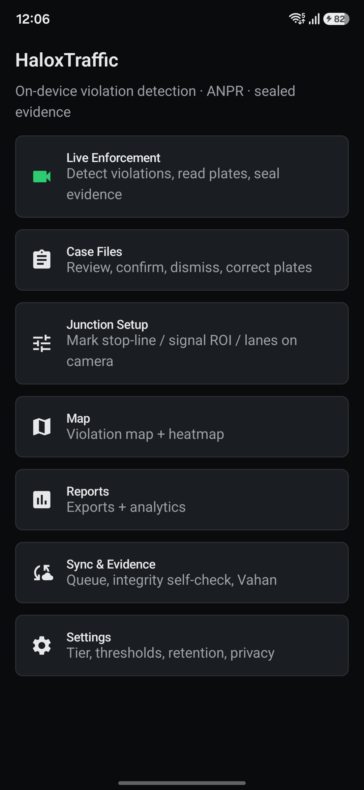
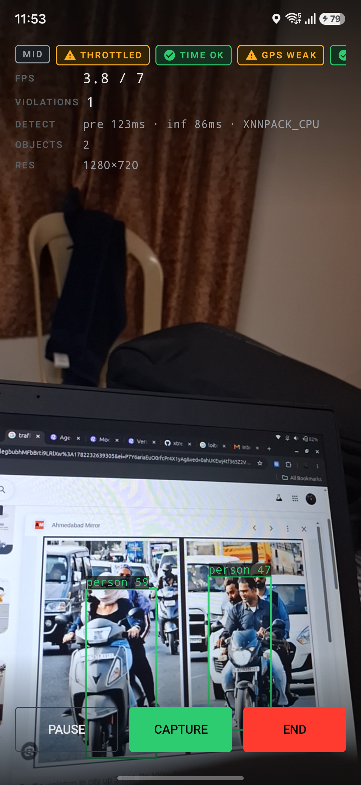
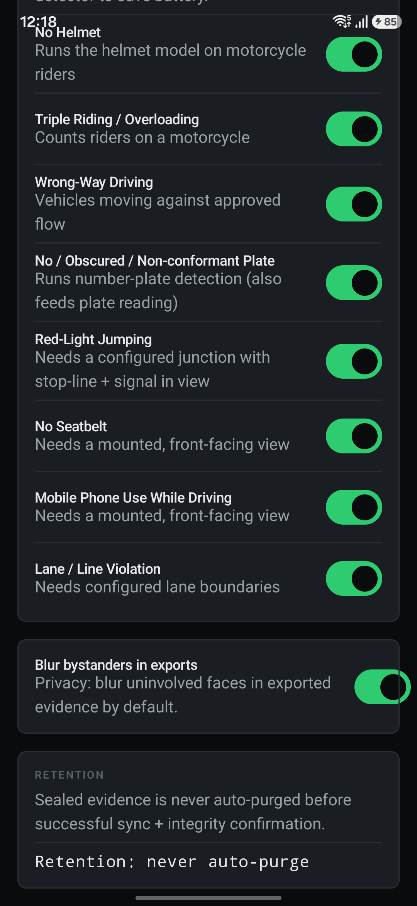

# HaloxTraffic

On-device Indian traffic violation detection, automatic number plate recognition (ANPR), and legal grade evidence collection for Android. Everything runs on the phone. No server is required for detection, recognition, or sealing. Network is used only for opportunistic sync.

Built for real street use on everyday hardware, from budget phones to flagships, with accuracy and chain of custody prioritised over visual flash.

## Field test (real outdoor data)

The app was taken outdoors and run live on a handheld phone in Bangalore, India on 24 June 2026. The numbers below are pulled directly from the on-device database and sealed evidence store after the run, not from a simulation.

Single continuous outdoor session:

| Metric | Value |
| --- | --- |
| Duration | 9.2 minutes, continuous, handheld |
| Violations detected and sealed | 51 |
| Route covered | about 1.5 km of road (lat 12.9835 to 12.9876, lon 77.7386 to 77.7533) |
| GPS accuracy | median 4.1 m (best 2.8 m, worst 9.6 m) |
| Compass heading captured | 45 of 51 cases |
| Device | Samsung Galaxy A17 (SM-A176B), profiled MID tier |

Totals across all on-device testing (22 sessions):

| Metric | Value |
| --- | --- |
| Tamper evident cases sealed | 72 |
| Context clips written (MP4) | 72 |
| Evidence stills written (JPG) | 117 |
| Sealed evidence on disk | about 258 MB |
| Cases with a real GPS fix | 72 of 72 |
| Cases sealed under trusted time | 72 of 72 |
| Cases with an ECDSA signature | 72 of 72 |
| Hash chain links (genesis plus chained) | 1 plus 71 |
| Per frame detection latency, three models active | about 64 to 86 ms |

Honesty note on the outdoor run: vehicle detection, plate detection, and the No or Obscured Plate finite state machine fired reliably and every case was sealed with GPS, trusted time, a SHA-256 hash, a previous hash link, and a hardware backed signature. Full plate text OCR reads on this particular run were low confidence on fast moving real plates and are flagged as uncertain rather than written as if they were clean results. The pipeline never fabricates a plate string.

## Screenshots

| Home | Live enforcement | Per violation toggles |
| --- | --- | --- |
|  |  |  |

## What it does

Detection and violations (each backed by a deterministic finite state machine):

- No Helmet, for motorcycle riders
- Triple Riding or Overloading
- Wrong Way Driving
- No, Obscured, or Non conformant Plate
- Red Light Jumping (needs a configured junction with the stop line and signal in view)
- No Seatbelt (needs a mounted, front facing view)
- Mobile Phone Use While Driving (needs a mounted, front facing view)
- Lane or Line Violation (needs configured lane boundaries)

Each violation can be switched on or off in Settings. Turning one off also skips its detector model to save battery. A violation only fires when the loaded models and the camera geometry can actually support it, so nothing false fires.

Automatic number plate recognition:

- Plate detection on cropped vehicle regions
- Best frame selection by sharpness
- PP-OCRv5 recognition with CTC decoding
- Plate format validation and multi frame consensus
- A read that cannot be validated is stored as a candidate for human confirmation, never as a clean result

Legal grade evidence:

- SHA-256 hashing over canonical bytes
- Append only hash chain that links each sealed package to the previous one
- ECDSA P-256 signing with Android Keystore, hardware backed where available
- GPS fix, heading, and accuracy attached to every case
- GPS or NTP anchored time with a trusted or untrusted flag
- Pre and post event context clip from a ring buffer, plus full resolution stills
- Immutable sealed store and an integrity self check

## How it runs on any phone

A device profiler reads RAM, system on chip, ABI, NNAPI availability, GPU delegate capability, and thermal headroom on startup, then assigns a tier.

| Tier | Strategy |
| --- | --- |
| LOW | reduced cadence and resolution, lightweight models, CPU friendly |
| MID | balanced cadence, crop based secondary models |
| HIGH | full cadence plus on device vision language enrichment, off the hot path |

An adaptive runtime controller watches latency, battery, and thermal state during a session and backs off cadence, then resolution, then optional stages, so the live preview never blocks and the device does not overheat.

## On device models

All inference is local. The following are bundled so detection works out of the box.

| Stage | Model | Runtime |
| --- | --- | --- |
| Vehicle and person detection | EfficientDet Lite0 (COCO) | MediaPipe Tasks Vision |
| Number plate detection | YOLOv11 license plate | ONNX Runtime |
| Helmet and no helmet | YOLOv8 helmet model | ONNX Runtime |
| Plate text recognition | PP-OCRv5 English mobile | ONNX Runtime |
| Incident description and hard plate reads (HIGH tier) | Gemma 3n | MediaPipe Tasks GenAI |

The plate and helmet models run only on the cropped vehicle and rider regions found by the base detector, which is both faster and more accurate than running them on the full frame.

## Architecture

Single Activity Jetpack Compose app with a unidirectional data flow, Hilt dependency injection, Kotlin coroutines and flows, and an eighteen module Gradle graph.

```
:app
:core:designsystem  :core:model  :core:data  :core:sensors  :core:evidence
:core:export  :core:sync
:feature:detection  :feature:violations  :feature:anpr  :feature:capture
:feature:casefile  :feature:map  :feature:reports  :feature:settings  :feature:vlm
```

Key technologies: Kotlin, Jetpack Compose, Hilt, Room, DataStore, WorkManager, CameraX, ONNX Runtime, MediaPipe Tasks, Retrofit and OkHttp, kotlinx.serialization.

## Build and run

Requirements: JDK 17, Android SDK with platform 35, a device or emulator on Android 8.0 (API 26) or newer.

```bash
# build a debug APK
./gradlew :app:assembleDebug

# install to a connected device
./gradlew :app:installDebug

# run the unit suite
./gradlew test
```

The debug APK is self contained. Onboarding shows the assigned device tier and the device profile, then the Live Enforcement screen renders the camera preview, the telemetry HUD, and live detection. Sessions, cases, and sealed evidence persist on device.

## Project status

This is a working, device verified build. Core detection, tracking, the violation finite state machines, plate detection, ANPR wiring, evidence sealing, the case file review flow, export bundles, the offline first sync queue, and the settings surface are all implemented and have been exercised on real hardware.

Open areas: outdoor plate text OCR accuracy on fast moving vehicles, helmet model quality for Indian traffic specifically, and tuning the viewpoint dependent violations that need a fixed mount or a configured junction.

## Privacy

Evidence captured outdoors can contain identifiable plates and faces. Raw outdoor evidence images are intentionally not published in this repository. Exports support bystander face blur, and sealed evidence is never auto purged before successful sync and an integrity check.
